<!--
  GENERATED FILE — do not edit README.md directly.
  Layout: profile/templates/README.md.tmpl · Content: profile/config/profile.toml
  Data: GitHub API, refreshed by .github/workflows/refresh-profile.yml
-->

<a href="https://manjunatha552355-rgb.github.io/manjunatha552355-rgb/"><picture><source media="(max-width: 600px)" srcset="profile/generated/hero-m.svg"></picture></a>

<a href="https://manjunatha552355-rgb.github.io/manjunatha552355-rgb/"><b>Interactive Portfolio ↗</b></a> &nbsp;·&nbsp; <a href="https://www.linkedin.com/in/manjunatha-m-ai-ml-genai-llm"><b>LinkedIn</b></a> &nbsp;·&nbsp; <a href="https://aiandmlconsultants.com/"><b>Website</b></a> &nbsp;·&nbsp; <a href="mailto:manjunatha552355@gmail.com"><b>Email</b></a>

## Professional Overview

I design and build AI systems end to end, from data pipelines and model architecture through evaluation to production delivery. My public work includes a domain-specific financial language model trained from scratch, an on-device speech pipeline for Android, an LLM evaluation framework for generative applications, and local-first observability tooling for AI agents. I care about measurable quality, cost-aware architecture and systems that remain maintainable after launch.

## Engineering Focus

<a href="#repository-explorer"><picture><source media="(max-width: 600px)" srcset="profile/generated/focus-m.svg"></picture></a>

## Technology Ecosystem

<picture><source media="(max-width: 600px)" srcset="profile/generated/stack-m.svg"></picture>

Evidence behind the technology map

| Technology | Area | Public repositories |
|---|---|---|
| NumPy | AI & ML | [Dwarka-trading](https://github.com/manjunatha552355-rgb/Dwarka-trading), [toon-llm](https://github.com/manjunatha552355-rgb/toon-llm) |
| ONNX Runtime | AI & ML | [AURA-AI-Assistant](https://github.com/manjunatha552355-rgb/AURA-AI-Assistant) |
| PyTorch | AI & ML | [toon-llm](https://github.com/manjunatha552355-rgb/toon-llm) |
| SciPy | AI & ML | [toon-llm](https://github.com/manjunatha552355-rgb/toon-llm) |
| Whisper | AI & ML | [AURA-AI-Assistant](https://github.com/manjunatha552355-rgb/AURA-AI-Assistant) |
| Google Gemini | LLM & GenAI | [email-generation-assistant](https://github.com/manjunatha552355-rgb/email-generation-assistant) |
| Model Context Protocol | LLM & GenAI | [cortextrace](https://github.com/manjunatha552355-rgb/cortextrace) |
| Pandas | Data & Analytics | [Dwarka-trading](https://github.com/manjunatha552355-rgb/Dwarka-trading), [toon-llm](https://github.com/manjunatha552355-rgb/toon-llm) |
| Matplotlib | Data & Analytics | [Dwarka-trading](https://github.com/manjunatha552355-rgb/Dwarka-trading) |
| yfinance | Data & Analytics | [Dwarka-trading](https://github.com/manjunatha552355-rgb/Dwarka-trading) |
| Pydantic | Backend & APIs | [toon-llm](https://github.com/manjunatha552355-rgb/toon-llm), [email-generation-assistant](https://github.com/manjunatha552355-rgb/email-generation-assistant) |
| FastAPI | Backend & APIs | [email-generation-assistant](https://github.com/manjunatha552355-rgb/email-generation-assistant) |
| OpenTelemetry | Backend & APIs | [cortextrace](https://github.com/manjunatha552355-rgb/cortextrace) |
| Streamlit | Backend & APIs | [Dwarka-trading](https://github.com/manjunatha552355-rgb/Dwarka-trading) |
| Cloudflare Workers | Cloud & DevOps | [AURA-AI-Assistant](https://github.com/manjunatha552355-rgb/AURA-AI-Assistant) |
| Docker | Cloud & DevOps | [toon-llm](https://github.com/manjunatha552355-rgb/toon-llm) |
| GitHub Actions | Cloud & DevOps | [cortextrace](https://github.com/manjunatha552355-rgb/cortextrace) |
| Android | Apps & Platforms | [AURA-AI-Assistant](https://github.com/manjunatha552355-rgb/AURA-AI-Assistant) |
| Electron | Apps & Platforms | [cortextrace](https://github.com/manjunatha552355-rgb/cortextrace) |
| Hilt | Apps & Platforms | [AURA-AI-Assistant](https://github.com/manjunatha552355-rgb/AURA-AI-Assistant) |
| Jetpack Compose | Apps & Platforms | [AURA-AI-Assistant](https://github.com/manjunatha552355-rgb/AURA-AI-Assistant) |
| React | Apps & Platforms | [cortextrace](https://github.com/manjunatha552355-rgb/cortextrace) |
| Room | Apps & Platforms | [AURA-AI-Assistant](https://github.com/manjunatha552355-rgb/AURA-AI-Assistant) |
| WorkManager | Apps & Platforms | [AURA-AI-Assistant](https://github.com/manjunatha552355-rgb/AURA-AI-Assistant) |

## Featured Projects

<a href="https://github.com/manjunatha552355-rgb/toon-llm"><picture><source media="(max-width: 600px)" srcset="profile/generated/card-toon-llm-m.svg"></picture></a>

<a href="https://github.com/manjunatha552355-rgb/toon-llm"><b>Repository</b></a>

<a href="https://github.com/manjunatha552355-rgb/cortextrace"><picture><source media="(max-width: 600px)" srcset="profile/generated/card-cortextrace-m.svg"></picture></a>

<a href="https://github.com/manjunatha552355-rgb/cortextrace"><b>Repository</b></a> &nbsp;·&nbsp; <a href="https://aiandmlconsultants.com/">Website</a> &nbsp;·&nbsp; <a href="https://github.com/manjunatha552355-rgb/cortextrace/tree/HEAD/docs">Documentation</a> &nbsp;·&nbsp; <a href="https://github.com/manjunatha552355-rgb/cortextrace/blob/HEAD/docs/ARCHITECTURE.md">Architecture</a>

<a href="https://github.com/manjunatha552355-rgb/AURA-AI-Assistant"><picture><source media="(max-width: 600px)" srcset="profile/generated/card-aura-ai-assistant-m.svg"></picture></a>

<a href="https://github.com/manjunatha552355-rgb/AURA-AI-Assistant"><b>Repository</b></a> &nbsp;·&nbsp; <a href="https://github.com/manjunatha552355-rgb/AURA-AI-Assistant/tree/HEAD/docs">Documentation</a>

<a href="https://github.com/manjunatha552355-rgb/Dwarka-trading"><picture><source media="(max-width: 600px)" srcset="profile/generated/card-dwarka-trading-m.svg"></picture></a>

<a href="https://github.com/manjunatha552355-rgb/Dwarka-trading"><b>Repository</b></a>

## Open Source

<a href="profile/CATALOG.md"><picture><source media="(max-width: 600px)" srcset="profile/generated/opensource-m.svg"></picture></a>

## Repository Explorer

<b>LLM & RAG</b> &nbsp;·&nbsp; 1 repository

| Repository | Description | Stack | Stars | Last commit |
|---|---|---|--:|---|
| [**toon-llm**](https://github.com/manjunatha552355-rgb/toon-llm) | India's Sovereign Financial Language Model — 152M params, Clifford algebra + THGA attention + RASOAP optimizer | Python · Docker · NumPy | 0 | Jun 2, 2026 |

<b>Generative AI</b> &nbsp;·&nbsp; 1 repository

| Repository | Description | Stack | Stars | Last commit |
|---|---|---|--:|---|
| [**email-generation-assistant**](https://github.com/manjunatha552355-rgb/email-generation-assistant) | MailCraft AI — Production-ready Email Generation Assistant powered by Google Gemini API with advanced prompt… | Python · FastAPI · Google Gemini | 0 | Apr 15, 2026 |

<b>AI Agents & Tooling</b> &nbsp;·&nbsp; 1 repository

| Repository | Description | Stack | Stars | Last commit |
|---|---|---|--:|---|
| [**cortextrace**](https://github.com/manjunatha552355-rgb/cortextrace) | Local-first desktop observability, tracing and threat detection for AI agents (Claude Code, Cursor, MCP… | TypeScript · Electron · GitHub Actions | 1 | Oct 1, 2026 |

<b>AI & Machine Learning</b> &nbsp;·&nbsp; 1 repository

| Repository | Description | Stack | Stars | Last commit |
|---|---|---|--:|---|
| [**AURA-AI-Assistant**](https://github.com/manjunatha552355-rgb/AURA-AI-Assistant) | AURA - ambient AI voice assistant for Android: on-device VAD, Opus, Whisper transcription, Gemini 4-pillar… | Kotlin · Android · Cloudflare Workers | 0 | Jul 16, 2026 |

<b>Analytics</b> &nbsp;·&nbsp; 1 repository

| Repository | Description | Stack | Stars | Last commit |
|---|---|---|--:|---|
| [**Dwarka-trading**](https://github.com/manjunatha552355-rgb/Dwarka-trading) | Algorithmic NSE trading dashboard — VWAP/EMA/RSI screening across 2000+ tickers, automated daily reports… | Python · Matplotlib · NumPy | 0 | Jul 16, 2026 |

<a href="profile/CATALOG.md">Full repository catalog →</a>

## GitHub Activity

<picture><source media="(max-width: 600px)" srcset="profile/generated/timeline-m.svg"></picture>

The contribution calendar below is GitHub's own · <a href="https://manjunatha552355-rgb.github.io/manjunatha552355-rgb/#activity">Interactive activity explorer ↗</a>

## Engineering Statistics

<picture><source media="(max-width: 600px)" srcset="profile/generated/stats-m.svg"></picture>

<picture><source media="(max-width: 600px)" srcset="profile/generated/distribution-m.svg"></picture>

## Connect

<a href="https://manjunatha552355-rgb.github.io/manjunatha552355-rgb/"><b>Interactive Portfolio ↗</b></a> &nbsp;·&nbsp; <a href="https://www.linkedin.com/in/manjunatha-m-ai-ml-genai-llm"><b>LinkedIn</b></a> &nbsp;·&nbsp; <a href="https://aiandmlconsultants.com/"><b>Website</b></a> &nbsp;·&nbsp; <a href="mailto:manjunatha552355@gmail.com"><b>Email</b></a>

Built from live GitHub data · latest activity Oct 8, 2026 · refreshed daily by GitHub Actions · <a href="profile/ARCHITECTURE.md">How this profile works</a>

